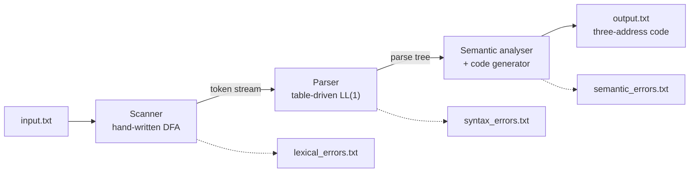

# C-minus Compiler

A one-pass compiler for **C-minus**, written from scratch in Python — no lexer
generator, no parser generator, no parsing library. Source text goes in,
executable three-address code comes out.

[](https://github.com/parsaivi/c-minus-compiler/actions/workflows/tests.yml)

[](LICENSE)

Built for the Compiler Design course (40-414) at Sharif University of
Technology, in three assignments that stack into one working compiler. Both
optional parts of the final assignment — the semantic analyser and code
generation for recursive functions — are implemented.



The parser never sees the whole token stream and the code generator never sees a
finished tree — each stage pulls from the one before it as it goes. The source
is read exactly once.

## What it compiles

```c
int fact(int n) {
    int f;
    if (n == 1) f = 1;
    else f = n * fact(n - 1);
    return f;
}

void main(void) {
    int i;
    i = fact(5);
    output(i);
}
```

```console
$ python3 compiler.py && python3 ../tools/tester.py output.txt
120
```

Recursion works because every call gets a real activation record on a runtime
stack, with locals and temporaries addressed relative to a frame pointer.

## The generated code

The target machine has ten instructions, four-byte words, and three addressing
modes: `100` direct, `@100` indirect, `#100` immediate. Compiling a `while`
loop yields this (abridged, with annotations added):

```
19   (ADD, 8, #12, 52)        ; &i  — FP + 12, into a scratch cell
22   (ADD, 8, #20, 60)
24   (LT, @60, #5, @64)       ; i < 5
26   (JPF, @68, 56, )         ; false → jump past the loop
...
48   (ADD, @40, #1, @44)      ; i + 1
55   (JP, 19, , )             ; back to the condition
60   (PRINT, @72, , )         ; output(sum)
```

The pile of `ADD`s is address arithmetic, not program arithmetic. The
instruction set has no register-plus-offset mode, so reaching an FP-relative
variable means computing its address into a scratch cell first and then
dereferencing it. That cost is the price of supporting recursion — see
[the code generation notes](docs/03-codegen.md#memory-layout).

## Quick start

Every phase is a single self-contained `compiler.py` that reads `input.txt`
from its working directory and writes its artefacts beside it.

```bash
git clone https://github.com/parsaivi/c-minus-compiler.git
cd c-minus-compiler/phase3-codegen

cp examples/bubble-sort/input.txt .
python3 compiler.py                       # → output.txt, semantic_errors.txt, …
python3 ../tools/tester.py output.txt     # 1 2 5 8 9
```

Phase 3 needs nothing but a stock Python 3.8. Phase 2 renders its parse tree
with [`anytree`](https://pypi.org/project/anytree/) — the single third-party
library the assignment permits — so running that phase on its own wants
`pip install -r requirements.txt` first. Phase 3 drops the dependency by
implementing the same `Node` and `RenderTree` in the file itself.

Run the whole regression suite:

```bash
python3 tools/run_tests.py
```

```
ok   phase2 core/T01
…
ok   phase3 bubble-sort -> 1 2 5 8 9
ok   phase3 factorial -> 120
ok   phase3 semantic-errors (rejected, 6 semantic errors)
ok   phase3 switch-goto -> 20

all 28 cases passed
```

## The three phases

| | Phase | Reads | Writes | Notes |
| --- | --- | --- | --- | --- |
| 1 | [Scanner](docs/01-scanner.md) | source text | `tokens.txt`, `lexical_errors.txt`, `symbol_table.txt` | hand-written DFA, one character of lookahead |
| 2 | [Parser](docs/02-parser.md) | token stream | `parse_tree.txt`, `syntax_errors.txt` | LL(1) parse table over 57 productions |
| 3 | [Code generator](docs/03-codegen.md) | parse tree | `output.txt`, `semantic_errors.txt` | six semantic checks, TAC, recursion |

Each phase folder contains the complete compiler up to that point, so
`phase3-codegen/compiler.py` is the finished product: scanner, parser, semantic
analyser and code generator in one file.

**Scanner.** A hand-rolled DFA over the token classes. `==` is the only
two-character token, so a single lookahead character keeps it deterministic.
Lexical errors recover in panic mode — bad input is consumed up to the next
plausible token boundary and scanning continues, so one stray `@` does not
derail the rest of the file.

**Parser.** Table-driven predictive parsing. FIRST and FOLLOW sets are written
out explicitly and `table[nonterminal][lookahead]` yields exactly one
production — the practical proof that the grammar is LL(1). Syntax errors
recover against FOLLOW sets as synchronising tokens. The grammar's curious
`Zegond` non-terminals are what left-factoring leaves behind once you make
`x = 1;` and `x + 1;` distinguishable with one token of lookahead;
[the parser notes](docs/02-parser.md#why-ll1) explain the trick.

**Code generator.** Walks the parse tree emitting three-address code, with
backpatching for every forward jump: `if`/`else`, `while`, `break`, C-style
`switch` fallthrough, and `goto` to labels defined later in the function.
Semantic analysis runs in the same pass; if any of the six checks fail, no code
is emitted at all.

## Semantic checks

Compiling `phase3-codegen/examples/semantic-errors/input.txt` — a program that
breaks every rule the analyser knows — produces:

```
#3  : Semantic Error! Illegal type of void for 'v'.
#12 : Semantic Error! 'y' is not defined.
#13 : Semantic Error! Mismatch in numbers of arguments of 'f'.
#14 : Semantic Error! Mismatch in type of argument 2 of 'f'. Expected 'int' but got 'array' instead.
#15 : Semantic Error! No 'while' found for 'break'.
#16 : Semantic Error! Type mismatch in operands, Got array instead of int.
```

All six are found in a single pass, each with its line number. Compilation
continues past every one of them so the whole file is reported at once — but
when any error is present, `output.txt` is left holding
`The output code has not been generated.` rather than code that cannot be
trusted.

## Language support

| | |
| --- | --- |
| Types | `int`, `void`, one-dimensional `int` arrays |
| Control flow | `if` / `else`, `while`, `break`, `goto` + labels, `switch` / `case` / `default` with fallthrough |
| Functions | multiple parameters, arrays by reference, return values, **recursion** |
| Operators | `+` `-` `*` `/`, comparison `<` `==`, unary `+` `-`, assignment |
| Built in | `output(int)` |
| Not supported | nested function definitions, pointers, `for`, structs, strings, floats |

## Layout

```
├── phase1-scanner/         compiler.py + a sample with one of every lexical error
├── phase2-parser/          compiler.py + 24 golden-file test cases
├── phase3-codegen/         compiler.py + four worked examples
├── tools/
│   ├── tester.py           interpreter for the generated three-address code
│   └── run_tests.py        regression runner for phases 2 and 3
├── docs/
│   ├── 01-scanner.md       tokens, the DFA, panic-mode recovery
│   ├── 02-parser.md        the grammar, FIRST/FOLLOW, the parsing loop
│   ├── 03-codegen.md       memory layout, calling convention, backpatching
│   └── assignments/        the original course specifications
└── requirements.txt        anytree, for phase 2 only
```

## Testing

Phase 2 is checked against golden files: 24 cases under `phase2-parser/tests/`,
each carrying the parse tree and error list the parser must reproduce
exactly — covering nested scopes, arrays, `switch` inside `while`, and inputs
seeded with syntax errors to exercise every recovery path.

Phase 3 is checked end to end: each example is compiled, the resulting
three-address code is executed by `tools/tester.py`, and the printed values are
compared against what the example is documented to produce. A compiler that
emits plausible-looking code that computes the wrong answer fails the suite.

`tools/tester.py` is a development helper — a standalone implementation of the
same ten instructions the course's own `Tester` interprets — so that anyone
cloning this repository can run the output without it. It is not part of the
compiler.

## Authors

Ali Moghadasi (402106542) and Parsa Malekian (402171075) — Compiler Design
(40-414), Sharif University of Technology.

## License

[MIT](LICENSE). The course assignment PDFs under `docs/assignments/` are the
work of the course staff and are included for reference only.
